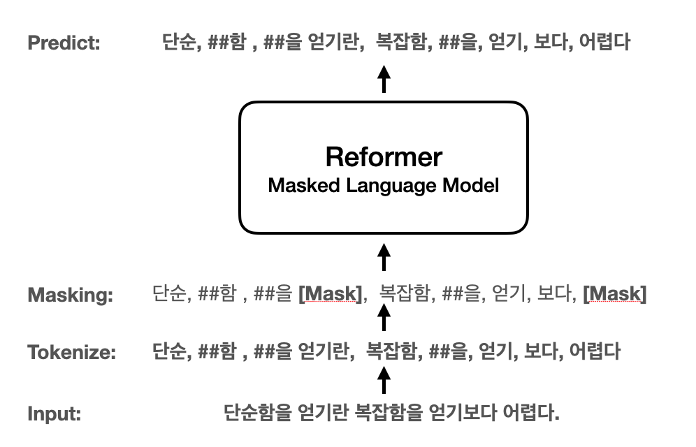
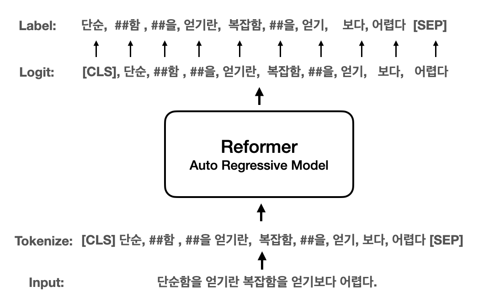

# Reformer Language Model
[reformer-pytorch](https://github.com/lucidrains/reformer-pytorch)를 이용한 다양한 Reformer Language Model Pretrain

## 📘 Vocab & Tokenizer
`Sentencepiece`와 `Wordpiece` 중 기존에 사용해보지 않은 Wordpiece Tokenizer를 이용한 Tokenizer 사용. 로
센텐스피스와 워드피스 모두 Subword Tokenizer중 하나인 **BPE(Byte Pair Encoding)** 에 속한다. 센텐스피스의 경우 빈도수를 기반으로, 워드피스의 경우 likelihood를 기반으로 BPE을 수행한다. 
#### WordPiece Tokenizer
1. huggingface tokenizers 설치
```shell script
pip install tokenizers
```
2. 말뭉치 파일로 Wordpiece vocab 생성
```python
import argparse
from tokenizers import BertWordPieceTokenizer

parser = argparse.ArgumentParser()

parser.add_argument("--corpus_file", type=str)
parser.add_argument("--vocab_size", type=int, default=22000) # 만들 Vocab의 숫자 
parser.add_argument("--limit_alphabet", type=int, default=6000)

args = parser.parse_args()

tokenizer = BertWordPieceTokenizer(
    vocab_file=None,
    clean_text=True,
    handle_chinese_chars=True,
    strip_accents=False, # Must be False if cased model
    lowercase=False,
    wordpieces_prefix="##"
)

tokenizer.train(
    files=[args.corpus_file],
    limit_alphabet=args.limit_alphabet,
    vocab_size=args.vocab_size
)

tokenizer.save("./ch-{}-wpm-{}-pretty".format(args.limit_alphabet, args.vocab_size),True)
```
3. 생성된 vocab 파일 전처리
```python
import json # import json module

vocab_path = "../vocab/ch-6000-wpm-22000-pretty"

vocab_file = '../data/wpm-vocab-all.txt'
f = open(vocab_file,'w',encoding='utf-8')
with open(vocab_path) as json_file:
    json_data = json.load(json_file)
    for item in json_data["model"]["vocab"].keys():
        f.write(item+'\n')

    f.close()
```
4. Tokenizer 테스트
```python
from transformers.tokenization_bert import BertTokenizer

vocab_path = "../data/wpm-vocab-all.txt"

tokenizer = BertTokenizer(vocab_file=vocab_path, do_lower_case=False)

test_str = ' [CLS] 나는 워드피스 토크나이저를 써요. 성능이 좋은지 테스트 해보려 합니다. [SEP]'
print('테스트 문장: ',test_str)

encoded_str = tokenizer.encode(test_str,add_special_tokens=False)
print('문장 인코딩: ',encoded_str)

decoded_str = tokenizer.decode(encoded_str)
print('문장 디코딩: ',decoded_str)

"""
테스트 문장:   [CLS] 나는 워드피스 토크나이저를 써요. 성능이 좋은지 테스트 해보려 합니다. [SEP]
문장 인코딩:  [2, 9310, 4868, 6071, 12467, 21732, 12200, 6126, 6014, 4689, 6100, 18, 11612, 6037, 9389, 6073, 16784, 17316, 6070, 10316, 18, 3]
문장 디코딩:  [CLS] 나는 워드피스 토크나이저를 써요. 성능이 좋은지 테스트 해보려 합니다. [SEP]
"""
```

## 💾 Data 
#### 사용 데이터
- 한국어 위키
- 한국어 나무 위키
- [모두의 말뭉치( 신문, 문어, 구어, 메신저, 웹)](https://corpus.korean.go.kr/main.do)
#### 데이터 전처리
- 주제 별로 한칸 개행.
- 라인 별로 개행
```
꿀맛행                 #라인 별 개행
꿀맛은 다음을 의미한다.  #라인 별 개행
                     #주제별 한칸 개행
쿠로야나기 료
《쿠로야나기 료》는 《따끈따끈 베이커리》에 등장하는 등장인물으로, 투니버스판 이름은 최강기. 성우는 코야스 타케히토, 최재호

꿀맛 (1961년 영화)
《꿀맛》(A Taste Of Honey)은 영국에서 제작된 토니 리처드슨 감독의 1961년 드라마 영화이다.
동명의 희극을 각색한 영화이다.
도라 브라이언 등이 주연으로 출연하였고 토니 리차드슨 등이 제작에 참여하였다.
```

## 🖥 학습 서버
nipa 정보통신진흥원 GPU 자원
- GPU 할당량: 10TF
- GPU 카드: RTX6000

## 🏭 Language Model 

### 1. Masked Language Model(ex. BERT without NSP,SOP..) 
BERT에서 사용 MLM을 이용한 언어모델 학습. NSP와 SOP 없이 학습 진행.

#### 모델 설정
##### BERT Model Config
|   |H=128|H=256|H=512|H=768|
|---|:---:|:---:|:---:|:---:|
| **L=2**  |[**2/128 (BERT-Tiny)**]|[2/256]|[2_512]|[2_768]|
| **L=4**  |[4/128]|[**4/256 (BERT-Mini)**]|[**4/512 (BERT-Small)**]|[4/768]|
| **L=6**  |[6/128]|[6/256]|[6/512]|[6/768]|
| **L=8**  |[8/128]|[8/256]|[**8/512 (BERT-Medium)**]|[8/768]|
| **L=10** |[10/128]|[10/256]|[10/512]|[10/768]|
| **L=12** |[12/128]|[12/256]|[12/512]|[**12/768 (BERT-Base)**]|

##### Reformer MLM Config
**BERT-Small** 과 **BERT-Medium**의 중간 크기
```
# Model Hyperparameter
max_len = 512     #전체 토큰 
batch_size = 128
dim = 512
depth = 6
heads = 8
causal = False
```
#### 학습 데이터
한국어 위키 512 토큰 이하로 나누어 데이터 생성
> 학습시 [CLS], [SEP] 토큰을 잊어버리고 학습함..
```
수학수학(數學, ) 은 양, 구조, 공간, 변화, 미적분 등의 개념을 다루는 학문이다.현대 수학은 형식 논리를 이용해서 공리로 구성된 추상적 구조를 연구하는 학문으로 여겨지기도 한다.수학은 그 구조와 발전 과정에서는 자연과학에 속하는 물리학을 비롯한 다른 학문들과 깊은 연관을 맺고 있다.하지만, 어느 과학의 분야들과는 달리, 자연계에서 관측되지 않는 개념들에 대해서까지 이론을 일반화 및 추상화시킬 수 있다는 차이가 있다고 한다.수학자들은 그러한 개념들에 대해서 추측을 하고, 적절하게 선택된 정의와 공리로부터의 엄밀한 연역을 통해서 추측들의 진위를 파악한다.수학은 숫자 세기, 계산, 측정 및 물리적 대상의 모양과 움직임을 추상화하고, 이에 논리적 추론을 적용하여 나타났다.이런 기본 개념들은 고대 이집트, 메소포타미아, 고대 인도, 고대 중국 및 고대 그리스의 수학책에서 찾아볼 수 있다.그리고, 유클리드의 원론에서는 엄밀한 논증이 발견된다.이런 발전은 그 뒤로도 계속되어, 16세기의 르네상스에 이르러서는 수학적 발전과 과학적 방법들의 상호 작용이 일어나, 혁명적인 연구들이 진행되며 인류 문명에 큰 영향을 미치게 되었다.그리고, 이는 현재까지도 계속되고 있다.오늘날 수학은 자연과학, 공학, 의학뿐만 아니라, 경제학 등의 사회과학에서도 중요한 도구로서도 사용된다.수학을 이런 분야들에 적용한 응용수학은 그 결과로써 수학 자체의 발전을 이끌고 새로운 분야들을 낳았다.응용이 아닌 수학 자체의 아름다움과 재미를 추구하며 연구하는 것을 순수수학이라 하는데, 긴 시간이 지난 뒤에 순수수학적 연구를 다른 분야에 응용할 방법이 발견된 경우도 많았다고 한다.대부분 자료를 보면, "mathematics"는 "수리적인"이라는 뜻을 가진 라틴어 mathmaticus와 그리스어 mathematikos에서 유래되었거나, "학식있는"을 뜻하는 mathema와 "배우다"를 뜻하는 manthanein에서 유래되었다고 한다.줄여서 "math"라고 표현하기도 한다.수학은 기원전 600년 경에 살았던 탈레스로부터 시작됐다.
하지만 탈레스가 태어나기 전에도 수학을 연구한 사람이 있을 수도 있기 때문에, 인류의 역사와 더불어 시작되었다고 할 수 있다.교역•분배•과세 등의 인류의 사회 생활에 필요한 모든 계산을 수학이 담당해 왔고, 농경 생활에 필수적인 천문 관측과 달력의 제정, 토지의 측량 또한 수학이 직접적으로 관여한 분야이다. 고대 수학을 크게 발전시킨 나라로는 이집트, 인도, 그리스, 중국 등이 있다.그 중에서도 그리스는 처음으로 수학의 방정식에서 변수를 문자로 쓴 나라이다.한국의 수학은 약 1,500년 전부터 기록으로 보이기 시작한다.신라 시대에 수학을 가르쳤으며, 탈레스가 최초로 발견한 일식과 월식을 예측할 정도로 발달했다.조선 시대에 훈민정음을 창제한 세종 대왕은 집현전 학자들에게 수학 연구를 명하는 등, 조선의 수학 수준을 향상시키기 위해서 많은 노력을 기울였다.하지만 임진왜란으로 많은 서적들이 불타고, 천문학 분야에서 큰 손실을 입었다.조선 후기의 한국의 수학은 실학자들을 중심으로 다시 발전하였고, 새로운 결과도 성취되었다.수학의 각 분야들은 상업에 필요한 계산을 하기 위해, 숫자들의 관계를 이해하기 위해, 토지를 측량하기 위해, 그리고 천문학적 사건들을 예견하기 위해 발전되어왔다.이 네 가지 목적은 대략적으로 수학이 다루는 대상인 양, 구조, 공간 및 변화에 대응되며, 이들을 다루는 수학의 분야를 각각 산술, 대수학, 기하학, 해석학이라 한다.또한 이 밖에도 근대 이후에 나타난 수학기초론과 이산수학 및 응용수학 등이 있다.산술은 자연수와 정수 및 이에 대한 사칙연산에 대한 연구로서 시작했다.수론은 이런 주제들을 보다 깊게 다루는 학문으로, 그 결과로는 페르마의 마지막 정리 등이 유명하다.또한 쌍둥이 소수 추측과 골드바흐 추측 등을 비롯해 오랜 세월 동안 해결되지 않고 남아있는 문제들도 여럿 있다.수의 체계가 보다 발전하면서, 정수의 집합을 유리수의 집합의 부분집합으로 여기게 되었다.또한 유리수의 집합은 실수의 집합의 부분집합이며, 이는 또다시 복소수 집합의 일부분으로 볼 수 있다.여기에서 더 나아가면 사원수와 팔원수 등의 개념을 생각할 수도 있다.
이와는 약간 다른 방향으로, 자연수를 무한대까지 세어나간다는 개념을 형식화하여 순서수의 개념을 얻으며, 집합의 크기 비교를 이용하여 무한대를 다루기 위한 또다른 방법으로는 기수의 개념도 있다.수 대신 문자를 써서 문제해결을 쉽게 하는 것과, 마찬가지로 수학적 법칙을 일반적이고 간명하게 나타내는 것을 포함한다.고전대수학은 대수방정식 및 연립방정식의 해법에서 시작하여 군, 환, 체 등의 추상대수학을 거쳐 현대에 와서는 대수계의 구조를 보는 것을 중심으로 하는 선형대수학으로 전개되었다.수의 집합이나 함수와 같은 많은 수학적 대상들은 내재적인 구조를 보인다.이러한 대상들의 구조적 특성들이 군론, 환론, 체론 그리고 그 외의 수많은 대수적 구조들을 연구하면서 다루어지며, 그것들 하나하나가 내재적 구조를 지닌 수학적 대상이다.이 분야에서 중요한 개념은 벡터, 벡터 공간으로의 일반화, 그리고 선형대수학에서의 지식들이다.벡터의 연구에는 산술, 대수, 기하라는 수학의 중요한 세개의 분야가 조합되어 있다.벡터 미적분학은 여기에 해석학의 영역이 추가된다.텐서 미적분학은 대칭성과 회전축의 영향 아래에서 벡터의 움직임을 연구한다.눈금없는 자와 컴퍼스와 관련된 많은 고대의 미해결 문제들이 갈루아 이론을 사용하여 비로소 해결되었다.공간에 대한 연구는 기하학에서 시작되었고, 특히 유클리드 기하학에서 비롯되었다.삼각법은 공간과 수들을 결합하였고, 잘 알려진 피타고라스의 정리를 포함한다.현대에 와서 공간에 대한 연구는, 이러한 개념들은 더 높은 차원의 기하학을 다루기 위해 비유클리드 기하학(상대성이론에서 핵심적인 역할을 함)과 위상수학으로 일반화되었다.수론과 공간에 대한 이해는 모두 해석 기하학, 미분기하학, 대수기하학에 중요한 역할을 한다.리 군도 공간과 구조, 변화를 다루는데 사용된다.
```

#### 모델
[reformer-pytorch](https://github.com/lucidrains/reformer-pytorch)를 사용한 MLM
```python
class ReformerLM(nn.Module):
    def __init__(self, num_tokens, dim, depth, max_seq_len, heads = 8, dim_head = None, bucket_size = 64, n_hashes = 4, ff_chunks = 100, attn_chunks = 1, causal = False, weight_tie = False, lsh_dropout = 0., ff_dropout = 0., ff_mult = 4, ff_activation = None, ff_glu = False, post_attn_dropout = 0., layer_dropout = 0., random_rotations_per_head = False, twin_attention = False, use_scale_norm = False, use_rezero = False, use_full_attn = False, full_attn_thres = 0, reverse_thres = 0, num_mem_kv = 0, one_value_head = False, emb_dim = None, return_embeddings = False, weight_tie_embedding = False, fixed_position_emb = False, absolute_position_emb = False, axial_position_shape = None, n_local_attn_heads = 0, pkm_layers = tuple(), pkm_num_keys = 128):
        super().__init__()
        emb_dim = default(emb_dim, dim)
        self.max_seq_len = max_seq_len

        self.token_emb = nn.Embedding(num_tokens, emb_dim)
        ...중략...
        if return_embeddings:
            self.out = Identity()
            return

        self.out = nn.Sequential(
            nn.Linear(dim, emb_dim) if emb_dim != dim else Identity(),
            nn.Linear(emb_dim, num_tokens) if not weight_tie_embedding else MatrixMultiply(self.token_emb.weight, transpose=True, normalize=True)
        )

    def forward(self, x, **kwargs):
        x = self.token_emb(x)
        x = x + self.pos_emb(x).type_as(x)

        x = self.to_model_dim(x)
        x = self.reformer(x, **kwargs)
        return self.out(x)
```
#### Fine-Tuning Test 결과
##### Korquad v1.0
|Task| exact_match | f1 score|
|------|---|---|
|Korquad v1.0|56.8|84.96|

예상보다 `exact_match` 부분에서 성능이 좋지 않게 나왔다. 생각해볼수 있는 개선 사항으로는
- 모델의 크기 증가
- 학습데이터에서 [CLS]와 [SEP] 토큰을 넣어주지 않은것
- Segment Embedding을 사용하지 않은것 

### 2. Auto Regressive(ex. GPT 계열)
Reformer Decoder를 이용한 Auto regressive language model.

##### 모델 크기
GPT-3 Small 과 동일한 모델 크기. **입력 토큰 수를 5120** 기존 모델들 대비 증가.
|Model Name|layer|d_model|n_head|batchsize|learning rate| n_params|
|----------|:---:|:-----:|:----:|:-------:|:-----------:|:-------:|
|GPT-3 Samll  |12|768 |12|64|0.5M|6.0 x 10^-4|125M|
|GPT-3 Medium |24|1024|16|65|0.5M|3.0 x 10^-4|350M|
##### 모델
```python
class ReformerAutoRegressiveModel(nn.Module):
    def __init__(self, num_tokens, dim, depth, max_seq_len, heads, causal=True):
        super().__init__()
        self.reformer = ReformerLM(
                num_tokens= num_tokens,
                dim= dim,
                depth= depth,
                heads= heads,
                max_seq_len= max_seq_len,
                causal= causal,           # auto-regressive 학습을 위한 설정
                return_embeddings=True    # reformer 임베딩을 받기 위한 설정
            )
        self.lm_head = nn.Linear(dim, num_tokens, bias=False)

    def forward(self,input_ids=None,labels=None,**kwargs):
        reformer_outputs = self.reformer(input_ids,**kwargs)
        hidden_states = reformer_outputs

        lm_logits = self.lm_head(hidden_states)

        loss = None
        if labels is not None:
            # Shift so that tokens < n predict n
            shift_logits = lm_logits[..., :-1, :].contiguous()
            shift_labels = labels[..., 1:].contiguous()
            # Flatten the tokens
            loss_fct = CrossEntropyLoss()
            loss = loss_fct(shift_logits.view(-1, shift_logits.size(-1)), shift_labels.view(-1))
        return lm_logits,loss
```

### 3. Replaced Token Detention(ex. ELECTRA)

##### 진행중..🚒

 
 ## Reformer-pytorch
 - `ReformerLM`의 **return_embeddings**은 reformer의 결과 값만 받고 싶은경우 설정