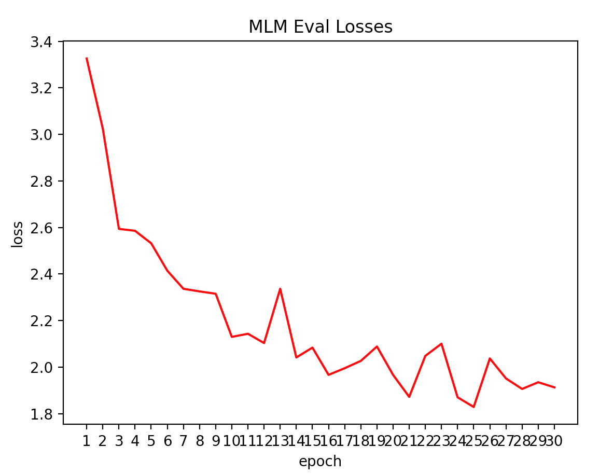
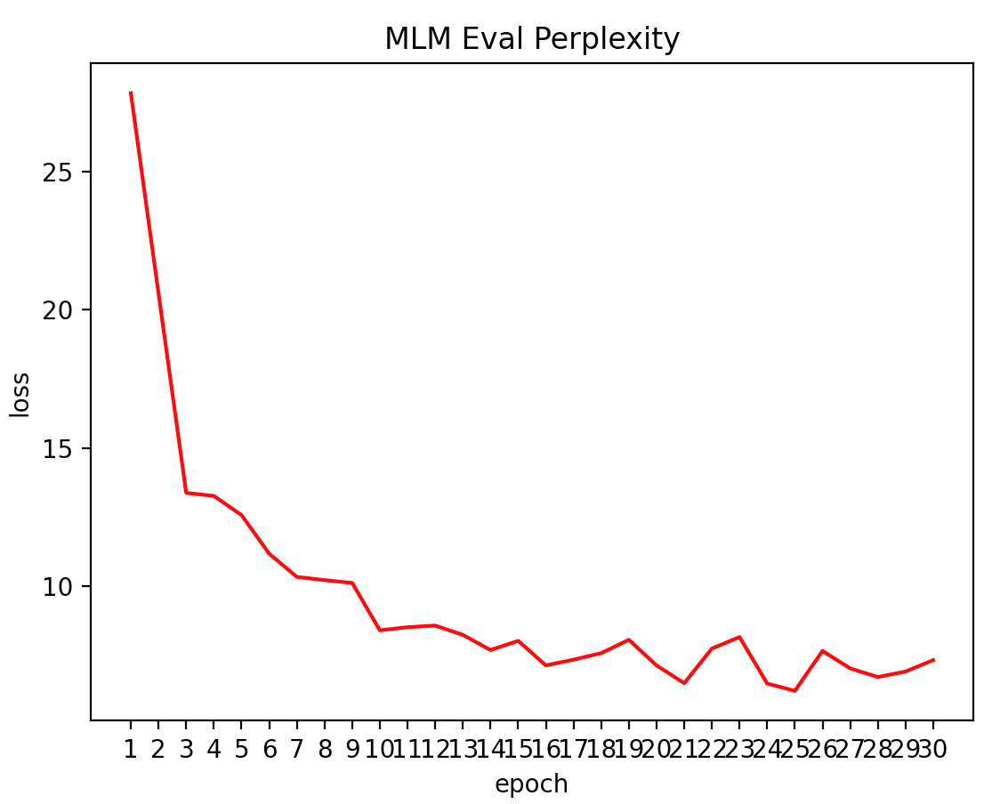
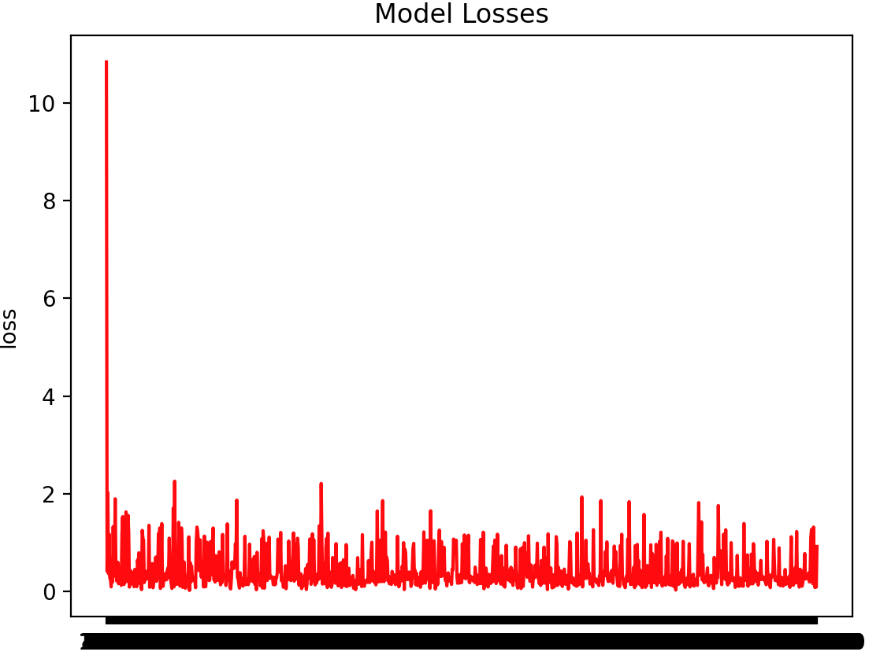
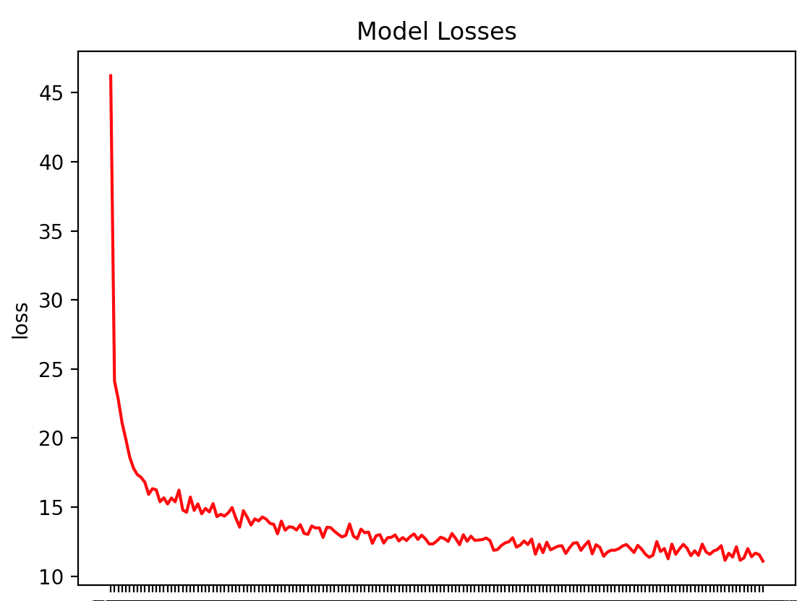

# Reformer Language Model
[reformer-pytorch](https://github.com/lucidrains/reformer-pytorch)를 이용한 다양한 Reformer Language Model

## Reformer
2020년에 발표 된 모델로, `LSH(Local Sensitive Hashing)`, `RevNet(Reversivle Residual Network)`, `Chunked Feed Forward Layer`,
`Axial Positional Encodings`을 통해서 트랜스포머의 메모리 문제를 개선하고자 시도한 모델. 

### Transformer의 단점
- `attention 계산`: 길이 **L**을 가진 문장의 어텐션을 계산할 때, **O(L^2)** 의 메모리와 시간 복잡도를 가진다.
- `많은 수의 레이어`: **N**개의 레이어틑 **N**배의 많은 메모리를 사용한다. 그리고 각각의 레이어는 역전파 계산을 위해 그 값들을 저장해둔다.
- `Feed Forward 레이어의 크기: Feed Forward 레이어가 Attention의 Activation 깊이 보다 더 클 수 있다. 
### Reformer
- `LSH(Local Sensitive Hashing)`: Dot-Product 사용하는 기존의 어텐션을 locality-sensitive hashing을 사용해 대체하면 기존의 O(L^2)을
O(L log(L))로 개선
- `RevNet`: 트랜스포머에서는 Residual Network에서 backpropagation를 위해 gradient 값을 저장하고 있다. reversible residual network을 이용하여
메모리 문제를 계산 문제로 바꾸어 메모리를 문제를 개선
- `Chunk`: Feed Forward layer의 각 부분은 위치와 관계 없이 독립적이기 때문에 청크 단위로 잘라서 계산할 수 있다. 이 점을 이용하여 메모리에 올릴 때 청크 단위로 메모리에 올려, 메모리 효율을 개선. 
- `Axial Positional Encoding`: 매우 큰 input sequence에 대해서도 positional encoding을 사용할 수 있게 하는 방법. 


## Vocab & Tokenizer
`Sentencepiece`와 `Wordpiece` 중 기존에 사용해보지 않은 Wordpiece Tokenizer를 이용한 Tokenizer 사용.
센텐스피스와 워드피스 모두 Subword Tokenizer중 하나인 **BPE(Byte Pair Encoding)** 에 속한다. 센텐스피스의 경우 빈도수를 기반으로, 워드피스의 경우 likelihood를 기반으로 BPE을 수행한다. 

## Data 
#### 사용 데이터
- 한국어 위키

## GPU
① nipa 정보통신진흥원 GPU 자원
- GPU 할당량: 10TF
- GPU 카드: RTX6000
- GPU RAM: 24G

② Google Colab pro

## Language Model 
### 1. Masked Language Model(ex. BERT) 
BERT에서 사용 MLM을 이용한 언어모델 학습. NSP와 SOP 없이 학습 진행.

#### Model
##### BERT Model Config
|   |H=128|H=256|H=512|H=768|
|---|:---:|:---:|:---:|:---:|
| **L=2**  |[**2/128 (BERT-Tiny)**]|[2/256]|[2_512]|[2_768]|
| **L=4**  |[4/128]|[**4/256 (BERT-Mini)**]|[**4/512 (BERT-Small)**]|[4/768]|
| **L=6**  |[6/128]|[6/256]|[6/512]|[6/768]|
| **L=8**  |[8/128]|[8/256]|[**8/512 (BERT-Medium)**]|[8/768]|
| **L=10** |[10/128]|[10/256]|[10/512]|[10/768]|
| **L=12** |[12/128]|[12/256]|[12/512]|[**12/768 (BERT-Base)**]|
##### Reformer-mlm-small Config
빠른 테스트를 위해 **BERT-base**의 절반 크기의 레이어 사용.
```
max_len = 512   
batch_size = 128
dim = 512
depth = 6
heads = 8
causal = False
```
#### 학습 데이터
한국어 위키 512 토큰 이하로 나누어 데이터 생성
```
[CLS] 구명은 분구될 때, 이 지역의 명산인 관악산(冠岳山)에서 따왔다.관악구의 행정 구역은 봉천동, 신림동, 남현동 3개의 법정동을 21개의 행정동으로 관리를 하고 있다. [SEP] 관악구의 면적은 29.57km이며, 인구는 2012년 12월 31일을 기준으로 247,598세대, 540,520명이다. [SEP] 서울 지하철 4호선 사당역은 서초구 및 동작구의 경계상에 접하고 있어 사실상 관악구의 전철역으로 보아도 무방하다. [SEP] 서울 지하철 7호선은 청림동을 통과하지만, 정거장은 없다. [SEP]  [SEP] 서초구 [SEP] 서초구(瑞草區)는 대한민국 서울특별시 남동부에 있는 구이다. [SEP] 남쪽으로는 경기도 성남시와 과천시, 동쪽으로는 강남구, 서쪽으로는 동작구와 관악구, 북쪽으로는 한강을 경계로 용산구와 접한다. [SEP] 면적은 약 47km로 서울특별시에서 가장 넓다. [SEP] 1988년에 강남구에서 분리되었다. [SEP] 구명은 분구될 때, 이 지역의 중심지인 서초동(瑞草洞)에서 유래하며, 서초동의 지명은 옛날 이곳이 서리풀이 무성했다 [SEP] 하여 이름붙여진 상초리(霜草里) 혹은 서초리(瑞草里)에서 온 것이다. [SEP] 또는 물이 서리어 흐르는 벌판이란 뜻으로 '서릿벌'이라 불렸는데 이것이 변해 서리풀이 된 것이라고도 한다. [SEP] 서초구는 서울특별시 한강 이남의 중앙부에 위치한 지역으로 동쪽으로는 강남구, 서쪽으로는 동작구와 관악구, 남쪽으로는 경기도 과천시와 성남시가 인접하고 북쪽으로는 한강 건너 용산구와 마주하고 있다. [SEP] 강남대로를 경계로 강남구, 동작대로 및 현충로, 남부순환로를 경계로 동작구, 관악구, 반포대교 및 한남대교 등을 경계로 용산구, 남태령을 경계로 경기도 과천시와 경부고속도로 및 청계산을 경계로 경기도 성남시와 경계를 이루고 있다. [SEP] 서초구의 행정 구역은 10개의 법정동을 18개의 행정동이 관리를 하고 있다. [SEP] 서초구의 면적은 47.00km이며, 서울시의 7.8%를 차지하고 있다. [SEP] 서초구의 인구는 2018년 2분기를 기준으로 443,989명, 174,268세대이다. [SEP] 
[CLS] 조선 제3대 태종과 그의 비 원경왕후의 묘인 헌릉과 제23대 순조와 그의 비 순원왕후 합장되어 있는 묘인 인릉이 있다.둘을 합하여 헌인릉이라 한다. [SEP] (내곡동 소재) [SEP] 구룡산(九龍山 : 306m)기슭에 세종대왕릉(英陵)이 있었으나, 영릉은 1469년(예종 1년)에 여주로 천장(遷葬)하였다. [SEP] (내곡동 소재) [SEP] 예술의 전당은 대한민국 최대 규모의 종합예술시설로서, 오페라하우스, 미술관, 서예관, 음악관 등이 있고, 예술의 전당 바로 옆에는 국립국악기관인 국립국악원이 있다. [SEP] (서초동 소재) [SEP] 서초동에는 교보문고, 대법원, 검찰청, 국립중앙도서관등이 있다. [SEP] 반포4동에는 신세계백화점, 마르퀘스플라자, 메리어트호텔, 호남선 고속버스터미널 등이 있는 센트럴시티가 있고 바로 옆에는 경부선 등 고속버스터미널이 있는 서울고속버스터미널이 있다. [SEP] 반포한강공원에는 세빛섬과 반포대교 달빛무지개 분수 등의 명소가 있다. [SEP] 서초구 양재동 일대에 자리잡고 있는 양재시민의 숲은 가족단위로 나들이하기에 좋은 공원으로 1986년 개장한 곳이다. 가을의 은행나무 낙엽길이 유명하다. [SEP] 양재동에는 유스호스텔인 서울교육문화회관과, 반포동 고속터미널에 JW 메리어트호텔 서울, 서울팔레스호텔이 위치하고 있다. [SEP] 방배동은 먹자골목으로 유명하다. [SEP] 1976년부터 한자리를 지켜온 레스토랑 "장미의 숲"은 1980년대 방배동을 "최고의 카페촌"으로 부상케 한 대표적인 곳이다. [SEP] 카페 "밤과 음악사이"는 1970~80년대 가요 [SEP] 와 인테리어를 하고 있으며, 통골뱅이와 김치찌개가 대표적인 안줏거리이다. [SEP] "멋쟁이 카페"들로 명성을 날렸던 방배동은 청담동에 그 명성을 내준 대신 요즘은 먹자골목으로 유명하다. [SEP] 이 일대는 아귀찜을 전문으로 하는 식당이 많다. [SEP] 
```

#### Pretraining Result
1. Eval Losses

1. Eval Perplexity

#### Fine-Tuning
##### Korquad v1.0
reformer-bert-small 모델에 대한 결과
**모델설정**
```t
max_len = 512  
batch_size = 128
dim = 512
depth = 6
heads = 8
```
|       model       | exact_match | f1 score|
|:-----------------:|-------------|---------|
|reformer-bert-small|    52.1     |  79.02  |
|      KoBERT       |    51.75    |  79.15  |

생각해볼수 있는 개선 사항으로는
- 모델의 크기 키우는 방법
- 학습 데이터를 증가시키는 방법

### 2. Auto Regressive(ex. GPT-2,3)
Reformer Decoder를 이용한 Auto regressive language model.

#### Model

|Model Name|layer|d_model|n_head|d_head|batchsize|learning rate| n_params|
|----------|:---:|:-----:|:----:|:----:|:-------:|:-----------:|:-------:|
|GPT-3 Samll  |12|768 |12|64|0.5M|6.0 x 10^-4|125M|
|GPT-3 Medium |24|1024|16|65|0.5M|3.0 x 10^-4|350M|

GPT-3 Small 과 동일한 모델 크기. **입력 토큰 수를 5120** 기존 모델들 대비 증가.
```text
max_len = 5120 # AxialPositionalEmbedding을 위한 (79,64) 값 and max_len/(bucket_size*2) == 0 이어야한다.
dim = 768
depth = 12
heads = 12
causal = True # True for ReformerLM Auto Regressive,
```

#### Usage
① `/config/autoregressive/`의 config 설정 확인  
② `/data` vocab 및 학습데이터 확인  
③ `/pretrain/autoregressive-model.py` 실행 
#### Pretraining
1052199 step 학습 도중 서버 중지로 학습 중지.


#### Text Generation 
파인튜닝 없이 사전학습된 언어모델만으로 텍스트 생성 테스트. Top-P Sampling 사용.
```text
사람이 철학적으로 생각하는 것은 그들에게 도움이 되겠음을 말해주고 있기 때문이다. 
예를 들었을 수도 있다면 ( 그 사람이 내재해 있기 ), 그 사람이 그 사람을 신에게 말하는 것이었다고 생각할 때 그것은 바로 신에 의해 선택되고 있다.
그러기 때문이며 또한 그것들을 신이 하듯이 그 사람은 내다 ( 내적 · 정신 ) 와 맺어져 있는 것이 아니라고 주장하거나 혹은 인간의 자유로 돌려질 것을 기대할 수가 없다는 것도 믿기 때문이다. 
신으로부터 그 사람을 하도록 선택하고 그것을 신에게 선택한 것으로 바꾸고 있는 것에 대해 말한다, 즉 그 사람에게 있어서는, 사람이 다른 사람은 거기에 개입하게 함으로서 자신의 창조나 자유롭거나 또는 보다 신에게 희생과 의무에 관한 질문으로 그 사람의 신에 관한 질문의 지식은 절대 이성적일 수는 없다고 하는 것은 아니라고 주장하는 것이다 라고 주장한다 
이 경우 ― 이러한 믿음이야말로 합법적으로 믿을 수도 없으며 또 그 사람의 신앙이 내적인 동기가 되는 것은, 이 신으로부터 온 것이라는 믿은 신에게로 돌이키는 것이다라고 주장한다. 
또 어떤 신에게는 신이 하려는 마음이 존재해서는 신에게 제의한 것도 있다 : 신이 하와 그 주위가 신에게서 양자를 받은 것은 신을 제하고 있는 것을 말한다. 라고 하여 그 신이 인간을 창조하는 것이라고 한다 : 
신이 있을 때에는 신의 존재의 개념을 신봉해야 한다 또 인간이 신을 창조할 때에는 인간이 창조되지 않고 그 사람의 이성이 필요하게 된다고 주장하는 사람이 존재한다 : 
이것이 바로 하나이고, 이것이 신에게 주어지는 신이다, 하나, 이 신에게서 신의 신에게 유도하는 신의 개념에 대해 논해진다 ― 신에게 신을 전하려고 하는 주장은 신의 뜻이나 신과 동일하고 그 신에 의해 구성된다는 것. 
신에게서 받은 개념이라고 하여서는 신으로부터 받은 것을 말하여, 거기에서는, 이 개념과 관련한 것은 없다라는 것 뿐이다 라며 이것을 부정하면 안 되고 있지만 신과 신이 인간의 관계에서는 신에 대해서 신과 신이라고 할 수 없게 되기 때문이다 ) 이라는 것은 신의 속성이라고 할 때 그 사람은 그 사람을 신이라고 부르는 사람이다 
( 이 경우는 신이었기, 신이 된다고 하는 것이다, 하지만 신이 되면 신이 된다고 한다.. 만약 누군지 신이 된다면 신의 속성이나 신의 이름으로 신의 이름으로 신의 대상이 되는 것도 아니며 신과 동일할 것이다고, 그러기 위하여 신이 인간과 같은 속성이라고 주장하였다가 바로 그것이 하나라고 해도 옳음의 성질로서의 하나라 하여도 그것이 신을 신으로 하여 신이 되어 인간 신의 조언인 것으로 된다. 
그러기에는 신이 인간과 신을 동일할 때에는, 신이 되어 자연적인 존재에 의한 것이라고 했다면 그것은 이미 고대인의 창조가 진전되는 것으로 되었다. 
만물에 관한 주장이라고 해서 그것은 신은 존재하지 않으므로 신의 존재를 신의 대상이 되는 존재가 된다는 의미일 수는 있다, 고 하는 것이다라고 하는 생각이 만도 주장하여야 한다. 
신은 존재하지 않는 것이 신은 아니며 인간이 존재하게 하는 것은 존재하지 않는 것이다'존재의 정의를 주장한 신에 의한 신이'가 존재하여 신이 존재하지 않는 존재이다 라고 생각했다 ) 라고 말한다. 
신의 속성이란 것이 존재하지 않는다 」 는 것이 되어 신이 존재하면 그것은 신이 존재할 리가 없으며 신을 만들어 내거나 또는 그 신으로부터 온 것을 알 필요가 있다고 했다라고 하는 것에 의해서 신은 존재하지 않는다고 하고 신에게 신이 존재한다. 
이 개념에는 신이 인간 자신이 존재하기 전부터 신으로 출현한 것으로 생각되고 있었던 것인 이상 신으로, 그 사람이란, 인간과 같은 존재를 가지거나 신과 관계가 존재한다고도 하는 것은 존재하고 있다는 것은 신이 존재한다 」 라는 것이 되지만 그 후 신에는 신에 의한 것도 존재하기 위해서는 신에 따라 구별되고 있기는 곤란하고 있기도 할 가능성 있다라고 할 것이다 … … 신의 존재가 어떻게 만들어질지, 
그 신에 의해 신이 인간에 있어서의 신성 ( 인격을 유지하지 않는다는 신의 힘인 존재는 존재하지 않는다는 논리가 되었다, 라고 했다, 라는 논의, 후설로서 「 존재하고 있어 ( 인간 존재를 존재하고 있은 ) 어떤 것 」 에 대해서는, 신이 인간에 있어서 존재할 수 있다는 것은 아니다 ( 이 주장 ) 라는 말은, 인간의 경우에는 타인과 비교가 되지만 그렇지 않는다 라고 하여 신 개념을 가지고 있을 가능성도 있고 있을지도 알수 있다
``` 
### 3. Replaced Token Detection(ex. ELECTRA)

#### Model 
`ELECTRA-small`의 모델 설정 사용
  
|                  |               | Layers | Embedding Size | Hidden Size | # heads |
| :--------------: | ------------: | -----: | -------------: | ----------: | ------: |
| `ELECTRA-small`  | Discriminator |     12 |            128 |         256 |      12 |
|                  |     Generator |     12 |            128 |         256 |       4 |로

#### Usage
① `/config/electra/`의 config 설정 확인  
② `/data` vocab 및 학습데이터 확인  
③ `/pretrain/electra-model.py` 실행 
#### Result

#### Fine-tuning
##### 실행
`finetuning/electra-korquad.ipynb` colab에서 실행
##### 결과
|                        | Exact Match(EM) |   F1   |
| :--------------------: | --------------: | -----: |
| Reformer-ELECTRA-small |           52.04 |  78.53 |
|         KoBERT         |           51.75 |  79.15 |


 
 # References
 - [The Reformer - Pushing the limits of language modeling](https://colab.research.google.com/drive/1MYxvC4RbKeDzY2lFfesN-CvPLKLk00CQ)
 - [reformer-pytorch](https://github.com/lucidrains/reformer-pytorch)
 - [electra-pytorch](https://github.com/lucidrains/electra-pytorch)
 - [나만의 BERT Wordpiece Vocab 만들기](https://monologg.kr/2020/04/27/wordpiece-vocab/)
